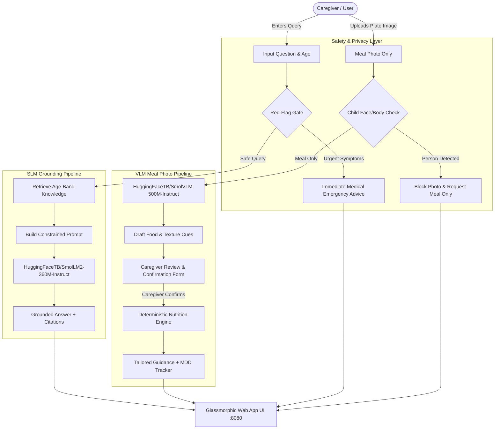

# NutriGuide SLM + Meal-Photo Companion

[](https://www.python.org/)
[](https://huggingface.co/HuggingFaceTB/SmolLM2-360M-Instruct)
[](https://huggingface.co/HuggingFaceTB/SmolVLM-500M-Instruct)
[](https://www.who.int/news-room/fact-sheets/detail/infant-and-young-child-feeding)
[](#privacy--safety-boundaries)

An evidence-grounded, on-device multimodal prototype for child nutrition and dietary diversity covering children aged **0 to 59 completed months**. 

NutriGuide demonstrates the principled, safe pattern for deploying Small Language Models (SLMs) and Vision-Language Models (VLMs) in sensitive healthcare education:
**Authoritative Domain Evidence &rarr; Deterministic Safety Gates &rarr; Bounded Constrained Inference &rarr; Mandatory Caregiver Verification &rarr; Auditable Citations**.

---

## Table of Contents

1. [Important Pediatric & Safety Boundaries](#important-pediatric--safety-boundaries)
2. [What NutriGuide Does](#what-nutriguide-does)
3. [The 8-Dimensional Pediatric Nutrition Taxonomy](#the-8-dimensional-pediatric-nutrition-taxonomy)
4. [System Architecture](#system-architecture)
5. [Models & Hardware Acceleration](#models--hardware-acceleration)
6. [Repository Structure](#repository-structure)
7. [Getting Started & Installation](#getting-started--installation)
8. [Running the Applications](#running-the-applications)
   - [Unified Web Application (Port 8080)](#1-unified-web-application-recommended)
   - [Gradio Photo Companion (Port 8899)](#2-standalone-gradio-photo-companion)
   - [Command-Line Evidence Inspector](#3-command-line-evidence-inspector)
9. [Automated Verification & Evaluation Suites](#automated-verification--evaluation-suites)
10. [REST API Documentation](#rest-api-documentation)
11. [Authoritative Source Registry](#authoritative-source-registry)

---

## Important Pediatric & Safety Boundaries

## What NutriGuide Does

NutriGuide provides a modern, dual-tab web interface designed with sleek glassmorphic aesthetics and responsive controls:

### Tab 1: Nutrition Assistant (SLM Chat & Diversity Guidelines)
- **Continuous Age Slider (0–59 Months)**: Smoothly transitions through 5 pediatric developmental stages with 1-click preset buttons (`0–5m`, `6–8m`, `9–11m`, `12–23m`, `24–59m`).
- **Interactive Food & Variety Guidelines Explorer**:
  - **Variety Target Banner**: Explains the exact nutritional diversity focus for the selected month (e.g., UNICEF's 5-of-8 groups indicator for 12–23m).
  - **Meal Cadence Indicator**: Highlights age-appropriate daily meal and snack frequencies.
  - **Recommended Food Category Cards**: Shows food group names, micronutrient rationales (iron, zinc, vitamins A & C), and safe food examples.
  - **Safe Textures & Foods to Avoid**: Clearly articulates developmental texture milestones alongside hazard items (e.g., honey under 12 months, unpasteurized products).
- **Dual Inference Engine**:
  - **SmolLM2-360M Generated**: Runs prompt-grounded local SLM text generation on Apple Silicon MPS or CPU.
  - **Curated Evidence Context**: Instant zero-latency retrieval of exact WHO and CDC evidence sentences.
- **Evidence Drawer & Citations**: Clickable source cards linking directly to normative publications from the WHO and CDC.

### Tab 2: Meal Photo Companion (Vision AI)
- **Meal Image Input**: Drag-and-drop or file upload for plate, bowl, or high-chair tray photos.
- **Built-In Sample Meals**:
  - **Sample 1**: Mashed Lentils & Rice (Khichdi) in a bowl (10 months) — pre-linked to real food photography.
  - **Sample 2**: Steamed Carrots & Oatmeal (14 months).
- **Local Vision Analysis**: 1-click inference using `SmolVLM-500M` to propose visible food names and texture cues.
- **8-Step Caregiver Review Form**: Enables the caregiver to edit visible foods, confirm food groups, textures, preparation steps, and allergen exposure.
- **UNICEF Minimum Dietary Diversity Indicator**:
  - Live **0–8 progress bar** tracking daily dietary diversity.
  - Dynamically updates as daily food groups are selected, visually celebrating when the target of &ge;5 groups is reached.
- **Safe Educational Interpretation**: Compiles caregiver-verified meal records into tailored feeding guidance and choking hazard prompts.

---

## The 8-Dimensional Pediatric Nutrition Taxonomy

NutriGuide organizes pediatric nutrition around an 8-dimensional framework grounded in normative WHO, UNICEF, and CDC clinical standards:

| # | Category | Examples / Formats | Why It Matters in Pediatric Care | Enforced In |
|---|---|---|---|---|
| **1** | **Age / development** | `0–5`, `6–8`, `9–11`, `12–23`, `24–59` months | Determines whether complementary feeding and certain textures are developmentally appropriate. | `data/nutrition_knowledge.json`, `app.py`, `server.py` |
| **2** | **Food groups** | Breast milk; grains/roots/tubers; pulses/nuts/seeds; dairy; flesh foods; eggs; vitamin-A-rich fruit/veg; other fruit/veg | WHO/UNICEF 6–23-month dietary diversity framework uses **8 distinct groups** to prevent micronutrient deficiencies. | `nutrition_engine.py`, `server.py`, `index.html` |
| **3** | **Texture** | Purée, mashed, lumpy/soft pieces, safe finger food, family-food texture | Must fit oral motor feeding skill—**not age alone**. Prevents choking while advancing self-feeding development. | `nutrition_engine.py`, `meal_photo_app.py` |
| **4** | **Preparation / safety** | Cooked, peeled, mashed, thinly spread, cut lengthwise / quartered | Choking hazard prevention. Round firm foods (grapes, cherry tomatoes, hot dogs) must be quartered lengthwise; hard vegetables steamed or grated. | `nutrition_engine.py`, `evaluate_meal.py` |
| **5** | **Allergen flag** | Egg, dairy, peanut/tree nut, wheat, soy, fish/shellfish | Prompts early, single-ingredient introduction at home with guidance to consult clinician if personal or family history of atopy exists. | `nutrition_engine.py`, `data/nutrition_knowledge.json` |
| **6** | **Added ingredients** | Honey, added sugar, excess salt, unpasteurized/raw foods | Enforces strict toxicological and clinical limits: **Honey is strictly forbidden <12 months** (infant botulism); **zero added sugars <24 months**. | `data/nutrition_knowledge.json`, `app.py` |
| **7** | **Meal pattern / cadence** | 2–3 meals (6–8m); 3–4 meals + 1–2 snacks (9–23m); 3 meals + 2 snacks (24–59m) | A single plate cannot reflect daily nutritional adequacy. Supports day-level feeding cadence complementary to milk intake. | `data/nutrition_knowledge.json`, `index.html` |
| **8** | **Confidence / verification** | Clearly visible / uncertain / caregiver-corrected | **Prevents treating model guesses as facts**. VLM observations are treated purely as drafts requiring mandatory caregiver confirmation. | `server.py`, `meal_photo_app.py`, `static/app.js` |

---

## System Architecture



---

## Models & Hardware Acceleration

| Model | Hugging Face ID | Parameters | Primary Role | Default Device |
|---|---|---|---|---|
| **SmolLM2** | `HuggingFaceTB/SmolLM2-360M-Instruct` | ~360 Million | Evidence-bounded question answering | Apple Silicon `mps` / CPU fallback |
| **SmolVLM** | `HuggingFaceTB/SmolVLM-500M-Instruct` | ~500 Million | Zero-shot meal-photo food & texture cues | Apple Silicon `mps` / CPU fallback |

- **Local Cache Management**: Models are downloaded once and cached in `./.hf_cache` via `HF_HOME="$PWD/.hf_cache"`. The application can run completely air-gapped without internet access once weights are cached.
- **Apple Silicon Acceleration**: On macOS devices with M1/M2/M3/M4 chips, PyTorch automatically binds to the Metal Performance Shaders (`mps`) backend in `float16`, providing text generation in ~3s and vision inference in ~2s.

---

## Repository Structure

```
outputs/nutrition_slm_module/
├── app.py                      # Core CLI application & prompt-grounding engine
├── server.py                   # High-performance HTTP server & REST API
├── meal_photo_app.py           # Standalone Gradio interface for meal photo reviews
├── nutrition_engine.py         # Deterministic pediatric rule engine & taxonomy validator
├── requirements.txt            # Python dependencies (transformers, torch, pillow, gradio)
├── README.md                   # This comprehensive documentation
├── EDUCATIONAL_MODULE.md       # Extended curriculum, clinical rationale & ethics guide
│
├── data/
│   └── nutrition_knowledge.json # Auditable ground truth evidence across all 5 age bands
│
├── static/                     # Web application frontend assets
│   ├── index.html              # Modern, semantic single-page application markup
│   ├── style.css               # Rich glassmorphic dark theme (vanilla CSS, responsive)
│   ├── app.js                  # Client-side reactivity, slider sync, and API wiring
│   └── samples/                # Pre-packaged sample meal images
│       ├── meal_lentils_rice.jpg    # Sample 1: Mashed lentils & rice (10 months)
│       └── meal_carrots_oatmeal.jpg # Sample 2: Steamed carrots & oatmeal (14 months)
│
├── evaluate.py                 # Automated regression suite for SLM knowledge context
├── evaluate_meal.py            # Automated test suite for meal-photo review logic
└── evaluate_framework.py       # Automated test suite for the 8-category taxonomy
```

---

## Getting Started & Installation

### Prerequisites
- Python **3.10** or higher
- pip and virtual environment support (`python3 -m venv`)
- ~3.5 GB of free disk space for PyTorch and cached Hugging Face model weights

### 1. Set Up Virtual Environment
```bash
# Navigate to the module directory
cd outputs/nutrition_slm_module

# Create and activate virtual environment
python3 -m venv .venv
source .venv/bin/activate

# Install dependencies into virtual environment
pip install -r requirements.txt
```

---

## Running the Applications

### 1. Unified Web Application (Recommended)

The primary application combines both the **Nutrition Assistant (SLM Chat)** and the **Meal Photo Companion (VLM)** into a single, unified web interface:

```bash
# Start the web server (defaults to port 8080)
HF_HOME="$PWD/.hf_cache" .venv/bin/python server.py 8080
```

Open your browser and navigate to:
```
http://localhost:8080
```

- **Tab 1: Nutrition Assistant**:
  - Drag the completed-months slider from 0 to 59.
  - Review the dynamically rendered variety targets, meal cadence, and food categories.
  - Ask questions in either **SmolLM2-360M Generated** mode or **Curated Evidence** mode.
  - Click **"📋 Framework Taxonomy"** in the top bar to inspect the complete 8-dimensional architecture table.
- **Tab 2: Meal Photo Companion**:
  - Click **"🥣 Sample 1: Mashed Lentils & Rice (10m)"** or upload an image.
  - Click **"1. Analyze Photo with SmolVLM-500M"** to run on-device vision inference.
  - Edit or confirm the observations in the caregiver review form.
  - Watch the **UNICEF Minimum Dietary Diversity Indicator** calculate the day-level score (target: &ge;5 of 8 groups).
  - Click **"8. Get Age-Specific Educational Guidance"** to generate the evidence-backed feeding interpretation.

---

### 2. Standalone Gradio Photo Companion

If you prefer testing the meal photo companion inside Gradio's standard interface:

```bash
HF_HOME="$PWD/.hf_cache" .venv/bin/python meal_photo_app.py
```

Navigate to `http://127.0.0.1:8899` (or the port defined by `NUTRIGUIDE_PORT`).

---

### 3. Command-Line Evidence Inspector

You can inspect the exact evidence context or run SLM text generation directly from your terminal:

```bash
# Inspect curated evidence for a 7-month-old (Zero model download needed)
.venv/bin/python app.py --age-months 7 --question "What is safe to introduce?" --context-only

# Run SmolLM2-360M inference for an 18-month-old
HF_HOME="$PWD/.hf_cache" .venv/bin/python app.py --age-months 18 --question "What textures and meal frequency should we offer?"
```

---

## Automated Verification & Evaluation Suites

NutriGuide includes three deterministic test suites to prevent regressions and verify compliance with clinical guidelines:

```bash
# 1. Knowledge Base & Context Checks (5 tests)
.venv/bin/python evaluate.py

# 2. Meal-Photo Workflow & Policy Checks (4 tests)
.venv/bin/python evaluate_meal.py

# 3. 8-Dimensional Educational Framework Checks (8 tests)
.venv/bin/python evaluate_framework.py
```

All 17 automated tests run without requiring network access.

---

## REST API Documentation

The server exposes a clean JSON REST API on `http://localhost:8080`:

### `GET /api/health`
Checks readiness of the SLM and VLM pipelines.
```json
{
  "status": "ok",
  "lm_ready": true,
  "vlm_ready": true,
  "lm_loading": false,
  "vlm_loading": false
}
```

### `GET /api/bands`
Returns all 5 age bands with full variety targets, meal cadence, food categories, safe textures, and foods to avoid.

### `GET /api/meal-meta`
Returns allowable food groups (8 UNICEF groups), textures, preparation safety flags, and allergen categories.

### `POST /api/query`
Executes an age-specific question query against either SmolLM2 or the curated evidence context.
**Request Body:**
```json
{
  "age_months": 10,
  "question": "What textures should my 10-month-old eat?",
  "use_model": true
}
```

### `POST /api/analyze-meal`
Processes an uploaded base64 image or a pre-packaged sample meal via `SmolVLM-500M`.
**Request Body:**
```json
{
  "sample": "meal_lentils_rice.jpg"
}
```
*or*
```json
{
  "image": "data:image/jpeg;base64,..."
}
```

### `POST /api/review-meal`
Evaluates caregiver-confirmed meal observations against pediatric dietary rules.
**Request Body:**
```json
{
  "age_months": 10,
  "foods": "mashed lentils, soft rice",
  "groups": ["Grains, roots and tubers", "Pulses, nuts and seeds"],
  "textures": ["Mashed", "Smooth puree"],
  "preparation": ["Cooked/softened", "Mashed/pureed"],
  "allergens": [],
  "daily_groups": ["Breast milk", "Grains, roots and tubers", "Pulses, nuts and seeds"],
  "confirmed": true
}
```

---

## Authoritative Source Registry

All educational guidance, safety rules, and dietary recommendations in NutriGuide are grounded in official, peer-reviewed clinical guidelines:

| Source ID | Reference Title | Authoring Body | Clinical Topic Covered |
|---|---|---|---|
| **WHO-IYCF** | [Infant and Young Child Feeding](https://www.who.int/news-room/fact-sheets/detail/infant-and-young-child-feeding) | World Health Organization | Exclusive breastfeeding, complementary feeding timing, meal cadence, responsive feeding |
| **WHO-BF** | [Breastfeeding Q&A](https://www.who.int/news-room/questions-and-answers/item/breastfeeding) | World Health Organization | Definition of exclusive breastfeeding; zero water in first 6 months |
| **WHO-CF-2023** | [Guideline for Complementary Feeding (6–23 Months)](https://www.who.int/publications/b/70981) | World Health Organization | Normative global complementary feeding standards |
| **WHO-EARLY-FOODS** | [Recommended Food for the Very Early Years](https://www.who.int/news-room/questions-and-answers/item/child-health-recommended-food-for-the-very-early-years) | World Health Organization | Texture progression, energy density, transition to family table foods |
| **UNICEF-DIET** | [Infant and Young Child Diets](https://data.unicef.org/topic/nutrition/diets/) | UNICEF Data | 5-of-8 food-group Minimum Dietary Diversity (MDD) population indicator |
| **WHO-GROWTH** | [Child Growth Standards](https://www.who.int/news-room/questions-and-answers/item/child-growth-standards) | World Health Organization | 0–5 year growth monitoring principles |
| **CDC-SOLIDS** | [When, What, and How to Introduce Solid Foods](https://www.cdc.gov/infant-toddler-nutrition/foods-and-drinks/when-what-and-how-to-introduce-solid-foods.html) | Centers for Disease Control and Prevention | Developmental readiness cues, texture progression, single-allergen introduction |
| **CDC-CHOKING** | [Choking Hazards Prevention](https://www.cdc.gov/infant-toddler-nutrition/foods-and-drinks/choking-hazards.html) | Centers for Disease Control and Prevention | Food preparation safeguards (quartering grapes lengthwise, steaming hard foods), active supervision |
| **CDC-LIMITS** | [Foods and Drinks to Avoid or Limit](https://www.cdc.gov/infant-toddler-nutrition/foods-and-drinks/foods-and-drinks-to-avoid-or-limit.html) | Centers for Disease Control and Prevention | Strict infant botulism prohibition on honey (<12m); zero added sugars (<24m) |
| **CDC-FOOD-SAFETY**| [Safer Food Choices Under 5](https://www.cdc.gov/food-safety/foods/children-under-5.html) | Centers for Disease Control and Prevention | Foodborne illness risk reduction; pasteurization mandates |

---

## License & Attribution

This educational prototype is developed for research and learning on small language model safety bounding. Model weights are subject to the respective Hugging Face community licenses:
- [SmolLM2-360M-Instruct License (Apache 2.0)](https://huggingface.co/HuggingFaceTB/SmolLM2-360M-Instruct)
- [SmolVLM-500M-Instruct License (Apache 2.0)](https://huggingface.co/HuggingFaceTB/SmolVLM-500M-Instruct)
