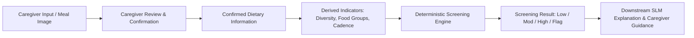

# Child Nutrition Screening Module: Product Boundary & Specification

> **Target Population:** Children from birth through 6 years of age (0 to 72 completed months).  
> **Current Implemented Rules:** 0 to 59 completed months (Phase 1). Rules for 60 to 72 completed months will be designed and implemented in subsequent phases.  
> **Status:** Phase 1 Product Boundary & Terminology Definition. Deterministic Low/Moderate/High scoring algorithm is under development.

---

## A. Purpose

The **Nutrition Screening Module** assesses whether a child's recent dietary intake pattern shows potential nutritional concerns based on age-appropriate feeding practices, dietary diversity, meal patterns, food-group exposure, and other screening indicators. 

It is intended to support **early identification of dietary patterns that may require attention**. 

It **does not diagnose** malnutrition, nutrient deficiency, disease, or any medical condition.

The conceptual architecture of the platform is:
$$\text{Nutrition Screening} + \text{Caregiver Education}$$

Screening identifies dietary patterns warranting review, while downstream educational guidance helps caregivers understand age-appropriate feeding principles and practical steps.

---

## B. Intended Users

The platform is designed to support:
- **Parents and primary caregivers** seeking objective review of feeding variety and meal patterns.
- **Community health workers (CHWs)** conducting routine child wellness checks.
- **Anganwadi and community screening centers** monitoring complementary feeding and dietary diversity indicators.
- **Child-health screening programs** evaluating population-level and individual dietary intake patterns.
- **Authorised screening personnel** conducting structured nutritional questionnaires.

> [!IMPORTANT]
> The module is a screening and educational support tool. It is **not** a substitute for a pediatrician, pediatric dietitian, or clinical medical provider.

---

## C. What the System Assesses

The screening framework evaluates broad dietary intake domains rather than clinical diagnoses. Future screening modules will encompass:

1. **Age-Appropriate Feeding Practices**: Alignment of feeding routines with developmental milestones (e.g., exclusive milk feeding from 0–5 months, timely introduction of solid foods at ~6 months).
2. **Recent Food Intake**: Caregiver-reported dietary items consumed in recent meals or recall periods.
3. **Dietary Diversity**: Day-level evaluation of food groups (grounded in the WHO/UNICEF 5-of-8 food group indicator for children 6–23 months and expanded diverse plate targets for older children).
4. **Meal Patterns & Cadence**: Meal and snack frequency across a 24-hour cycle relative to developmental recommendations.
5. **Food-Group Exposure**: Presence and variety of essential food groups (grains/tubers, pulses/nuts/seeds, dairy, flesh foods, eggs, vitamin-A-rich produce, other produce).
6. **Nutrient-Dense Food Exposure**: Routine inclusion of whole, minimally processed food items.
7. **Fruit and Vegetable Patterns**: Regular exposure to a spectrum of colorful fruits and vegetables.
8. **Protein-Rich Food Patterns**: Age-appropriate intake frequency of plant and animal proteins.
9. **Iron-Rich Food Patterns**: Presence of iron-rich foods in complementary feeding (especially critical from 6 months onward as infant iron stores deplete).
10. **Unhealthy-Food & Sweetened-Beverage Exposure**: Screening for premature introduction of honey (<12 months), sugar-sweetened beverages, caffeinated drinks, ultra-processed foods, or excessive sodium.
11. **Feeding-Related Concerns**: Reported feeding difficulties, texture refusal, or unsafe feeding postures requiring attention.
12. **Sufficiency of Information**: Verifying whether reported data is sufficient to complete screening, flagging `INSUFFICIENT_DATA` when evidence is incomplete.

*These domains represent nutritional screening dimensions, never clinical or medical diagnoses.*

---

## D. What the System Does Not Do

The system strictly enforces clear safety boundaries. It does **NOT**:

- **Diagnose malnutrition** (e.g., severe acute malnutrition, moderate acute malnutrition, stunting, or wasting).
- **Diagnose micronutrient deficiency** (e.g., iron deficiency, anemia, zinc deficiency, calcium deficiency).
- **Diagnose medical conditions or disease** (e.g., celiac disease, metabolic disorders, food allergies).
- **Replace laboratory testing** (e.g., serum ferritin, complete blood count, electrolyte panels).
- **Prescribe supplements or pharmaceuticals** (e.g., high-dose vitamin drops, iron syrups, medical formulas).
- **Prescribe therapeutic treatments** (e.g., Ready-to-Use Therapeutic Food [RUTF] protocols).
- **Replace professional clinical assessment** (physical exams, pediatric growth tracking, swallowing evaluations).
- **Infer blood nutrient levels or health status from meal images** (photos only propose visible food candidates and texture cues).
- **Determine overall nutritional adequacy from a single meal** (dietary adequacy requires multi-day intake patterns).

> [!CAUTION]
> **Vitamin D Exclusion:**  
> **Vitamin D-specific screening is intentionally excluded from the current implementation and will be considered separately in a future phase.** The system does not calculate Vitamin D risk scores, predict serum 25(OH)D levels, track Vitamin D supplementation, or infer Vitamin D deficiency.

---

## E. Screening Result Terminology

To avoid diagnostic overreach, the platform employs standardized screening terminology that reflects **screening priority** rather than clinical disease severity:

| Screening Category | Definition | Intended Action |
|---|---|---|
| `LOW_SCREENING_CONCERN` | Reported dietary pattern aligns well with age-appropriate diversity and feeding cadence standards. | Continue positive feeding practices and standard age-appropriate guidance. |
| `MODERATE_SCREENING_CONCERN` | Reported intake shows limited food-group variety or minor meal pattern inconsistencies. | Provide caregiver guidance on introducing missing food groups and review pattern over time. |
| `HIGH_SCREENING_CONCERN` | Reported intake pattern demonstrates persistent gaps across core food groups (e.g., minimal iron-rich foods, high sugar exposure, very limited diversity). | Recommend prompt review of dietary practices and consultation with a healthcare professional. |
| `INSUFFICIENT_DATA` | Incomplete caregiver input or insufficient information to complete screening safely. | Request clarification or recommend completing a structured intake recall. |
| `PROFESSIONAL_REVIEW_FLAG` | Caregiver reports potential clinical symptoms, growth faltering, severe choking events, or red flags. | Immediate referral to a qualified pediatrician or emergency medical services. |

---

## F. AI Model Roles: Communication vs. Decision-Making

The platform establishes a strict architectural boundary between deterministic logic and generative AI models:

### 1. The Core Principle: SLM = Communication, NOT Decision Maker

Generative language models (SLMs) must never calculate, infer, upgrade, or downgrade screening risk. The deterministic rule engine alone determines screening categories and findings.

```
Deterministic Rule Engine Output
{
  "screening_result": "MODERATE_SCREENING_CONCERN",
  "findings": [
    "The reported diet contains limited iron-rich foods.",
    "Dietary diversity is below the recommended 5 of 8 food groups."
  ]
}
      ↓
SLM (Small Language Model)
      ↓
"Explain this to the caregiver in simple, supportive, encouraging language."
```

- **Decision Maker:** Deterministic pediatric rule engine (evaluating age, food groups, cadence, variety targets, and safety flags).
- **Communication Layer:** SLM translates structured screening findings and clinical evidence into clear, actionable, caregiver-friendly explanations.
- **Strict Prohibition:** If a model replacement occurs, the replacement model must **never** be permitted to calculate screening risk or diagnose conditions.

### 2. Mandatory Caregiver Verification for Vision AI

> *AI-generated meal observations must not be treated as confirmed dietary facts until reviewed or confirmed by the caregiver/user.*  
Vision model (VLM) outputs are treated exclusively as editable candidate drafts (`requires_confirmation: true`). No dietary screening calculation is performed without explicit caregiver verification of visible foods, preparation, and textures.

---

## G. Model Evaluation & Upgrade Roadmap

Model upgrades are planned systematically after deterministic rules are validated:

### Text Model (SLM) Benchmark Roadmap
- **Current Baseline:** `SmolLM2-360M-Instruct` (HuggingFaceTB) — efficient, on-device baseline for constrained text generation.
- **First Upgrade Experiment Candidate:** `Qwen/Qwen3-1.7B` (Apache 2.0 license).
- **Benchmarking Protocol:** Benchmark `Qwen3-1.7B` against `SmolLM2-360M` strictly for communication clarity, caregiver empathy, prompt compliance, and non-diagnostic constraint adherence *after the deterministic engine is complete and operational*.

### Vision Model (VLM) Benchmark Roadmap (Phase 19)
- Vision quality is paramount for accurate plate observation, texture cue identification, and hazard spotting.
- **Current Baseline:** `SmolVLM-500M-Instruct` (HuggingFaceTB).
- **Upgrade Candidates:**
  - `Qwen3-VL-2B-Instruct` (Apache 2.0 license)
  - `Qwen3-VL-4B-Instruct` (Apache 2.0 license)
- **Benchmarking Protocol:** Evaluate candidates specifically on the pediatric meal-image dataset (comparing visible-food identification accuracy, texture differentiation, and child/face detection) rather than generic multimodal benchmarks.

---

## H. Comprehensive Evaluation Dataset Architecture & Benchmark Sources

To verify the pediatric screening platform's boundaries, rule consistency, and vision safeguards, NutriGuide integrates a formal evaluation benchmark suite:

```
data/eval/
├── deterministic_nutrition_cases.json  # 70 structured pediatric clinical test cases
└── meal_photo_cases.json              # 110 structured meal photograph benchmark cases
```

### 1. Authoritative Source Datasets for Ground Truth & Rules

| Dataset | Canonical Source / Reference | Role in NutriGuide Rule Grounding |
|---|---|---|
| **CNNS 2016–18** | [CNNS Official Reports – National Health Mission](https://nhm.gov.in/index1.php?lang=1&level=2&lid=713&sublinkid=1332) | Best India-specific reference covering 0–4 years (`CNNS_04`) and 5–9 years (`CNNS_59`). Ground truth for micronutrient risk, complementary food timing, and dietary patterns. |
| **CNNS Data Note** | [CNNS Dataset Documentation (MoHFW)](https://healthnutritionindia.in/reports/documents/25/CNNS-v1.0-Data-Note-for-MoHFW.pdf) | Dataset structure, variables, and codebook for `CNNS_04` (infant/toddler) and `CNNS_59` (preschool/school-age). |
| **NFHS-5 India 2019–21** | [NFHS-5 Microdata Page (World Bank)](https://microdata.worldbank.org/catalog/4482) & [DHS India NFHS-5](https://www.dhsprogram.com/publications/publication-FR375-DHS-Final-Reports.cfm) | Standardized infant and young child feeding (IYCF) variables: exclusive breastfeeding, timely introduction of solid/semi-solid foods, minimum meal frequency, and junk food exposure. |
| **UNICEF IYCF Datasets** | [UNICEF Infant & Young Child Feeding Datasets](https://data.unicef.org/resources/dataset/infant-young-child-feeding/) | Standardized WHO/UNICEF population indicators for 0–23 months: Minimum Dietary Diversity (MDD 5-of-8 food groups), Minimum Acceptable Diet (MAD), and zero-vegetable-or-fruit consumption. |
| **UNICEF IYCF Indicator Portal** | [UNICEF IYCF Overview & Indicators](https://data.unicef.org/topic/nutrition/infant-and-young-child-feeding/) | Definitions and reference thresholds for rule catalogues and dietary diversity tracking. |
| **NHANES Dietary (2021–23 & Archives)** | [NHANES Dietary Datasets (CDC/NCHS)](https://wwwn.cdc.gov/nchs/nhanes/search/datapage.aspx?Component=Dietary&Cycle=2021-2023) | Detailed 24-hour individual dietary recall records, food portion distributions, sodium, and added sugars, particularly for children aged 2–6 years (24–72 months). |
| **FITS** | [Feeding Infants and Toddlers Study (FITS)](https://www.nestlenutrition-institute.org/academies/toddler-hub/fits) | 24-hour dietary-recall methodology, developmental texture progression, and choking hazard exposure in infants and toddlers. |

### 2. Vision Recognition Benchmark Datasets for Meal Photos

| Dataset | Canonical Source / Study | Application in Vision AI Benchmarking |
|---|---|---|
| **IndianFoodNet30** | [IndianFoodNet30 on Roboflow Universe](https://universe.roboflow.com/indianfoodnet/indianfoodnet) & [2026 Frontiers in Computer Science Study](https://www.frontiersin.org/journals/computer-science/articles/10.3389/fcomp.2026.1753764/full) | Primary benchmark for multi-dish Indian meals (dal, khichdi, roti, rice, sabzi, curd, paneer, thalis). |
| **UECFoodPix / UECFoodPixComplete** | [UECFoodPix Official Download](https://mm.cs.uec.ac.jp/uecfoodpix/) | Multi-food detection and pixel-level segmentation on plates, divided trays, and bowls. |
| **UEC-Food100 / 256** | [UEC-Food Benchmark Series](https://mm.cs.uec.ac.jp/uecfoodpix/) | Broader multi-category food recognition benchmarking across global dietary items. |

### 3. Aggressive Age Boundary Pair Verification

Pediatric age-boundary bugs are clinically dangerous because nutritional requirements, swallowing motor skills, toxicological hazards, and choking risks shift abruptly at developmental transitions:

1. **5 months vs 6 months:**
   - *5 months:* Exclusive milk feeding (breast milk or infant formula); zero solids, zero water. Meal photo analysis blocked.
   - *6 months:* Complementary feeding begins; smooth purees, iron-rich first foods (pulses, pureed meat, fortified cereal), 2–3 meals/day.
2. **8 months vs 9 months:**
   - *8 months:* 6–8m band (2–3 meals/day, smooth/mashed textures, milk remains primary calorie source).
   - *9 months:* 9–11m band (cadence steps up to 3–4 meals/day + 1–2 snacks; pincer grasp emergence, finely chopped soft finger foods).
3. **11 months vs 12 months:**
   - *11 months:* **Honey is strictly prohibited** (*Clostridium botulinum* spore risk). Cow's milk as primary beverage prohibited.
   - *12 months:* Honey safe (mature gut flora); pasteurized whole cow's milk allowed as beverage (16–24 oz/day). UNICEF MDD (&ge;5 of 8 food groups) applies.
4. **23 months vs 24 months:**
   - *23 months:* Strict **zero added sugars** policy (<24m, CDC & AAP); whole milk recommended for neurodevelopment.
   - *24 months:* Early childhood transition (2–5 years); low-fat milk transition option; added sugars limited (<10% calories).
5. **35 months vs 36 months:**
   - *35 months:* Late toddler (under 3 years); rotary chewing fatigue; acute choking hazards on hard raw carrots, whole nuts, hard candies.
   - *36 months:* 3-year preschool milestone; complete primary dentition (20 deciduous teeth); table foods alongside family; standing height tracking.
6. **59 months vs 60 months:**
   - *59 months:* Upper bound of currently active Phase 1 implemented rules (24–59m band).
   - *60 months:* School-age child transition (5–6 years / 60–72 completed months); recognized within 0–72m target scope and safely deferred to Phase 2 school-age rules.
7. **71 months vs 72 months:**
   - *71 months:* 5 years 11 months; within target scope.
   - *72 months:* Exactly 6 completed years; exact upper boundary of platform product scope.
   - *> 72 months:* Explicitly identified as out of scope (>6 years).

---

## I. Future Architecture Pipeline

In subsequent implementation phases, the full screening engine will execute the following pipeline:



*Phase 1 establishes the product boundary, safety gating, terminology, evaluation datasets, and system constraints. The complete Low/Moderate/High scoring engine and age-specific rules for 60–72 months will be developed in Phase 2.*

